# Project  

This project is about data preprocessing on a Kaggle dataset named "LendingClub" : https://www.kaggle.com/wordsforthewise/lending-club and application of Deep neural network on such data. 
The project answered by me.

### Our Goal

Given historical data on loans given out with information on whether or not the borrower defaulted (charge-off), can we build a model thatcan predict wether or nor a borrower will pay back their loan? This way in the future when we get a new potential customer we can assess whether or not they are likely to pay back the loan. Keep in mind classification metrics when evaluating the performance of your model!

The "loan_status" column contains our label.

### Data Overview

----
-----
There are many LendingClub data sets on Kaggle. Here is the information on this particular data set:

<table border="1" class="dataframe">
  <thead>
    <tr style="text-align: right;">
      <th></th>
      <th>LoanStatNew</th>
      <th>Description</th>
    </tr>
  </thead>
  <tbody>
    <tr>
      <th>0</th>
      <td>loan_amnt</td>
      <td>The listed amount of the loan applied for by the borrower. If at some point in time, the credit department reduces the loan amount, then it will be reflected in this value.</td>
    </tr>
    <tr>
      <th>1</th>
      <td>term</td>
      <td>The number of payments on the loan. Values are in months and can be either 36 or 60.</td>
    </tr>
    <tr>
      <th>2</th>
      <td>int_rate</td>
      <td>Interest Rate on the loan</td>
    </tr>
    <tr>
      <th>3</th>
      <td>installment</td>
      <td>The monthly payment owed by the borrower if the loan originates.</td>
    </tr>
    <tr>
      <th>4</th>
      <td>grade</td>
      <td>LC assigned loan grade</td>
    </tr>
    <tr>
      <th>5</th>
      <td>sub_grade</td>
      <td>LC assigned loan subgrade</td>
    </tr>
    <tr>
      <th>6</th>
      <td>emp_title</td>
      <td>The job title supplied by the Borrower when applying for the loan.*</td>
    </tr>
    <tr>
      <th>7</th>
      <td>emp_length</td>
      <td>Employment length in years. Possible values are between 0 and 10 where 0 means less than one year and 10 means ten or more years.</td>
    </tr>
    <tr>
      <th>8</th>
      <td>home_ownership</td>
      <td>The home ownership status provided by the borrower during registration or obtained from the credit report. Our values are: RENT, OWN, MORTGAGE, OTHER</td>
    </tr>
    <tr>
      <th>9</th>
      <td>annual_inc</td>
      <td>The self-reported annual income provided by the borrower during registration.</td>
    </tr>
    <tr>
      <th>10</th>
      <td>verification_status</td>
      <td>Indicates if income was verified by LC, not verified, or if the income source was verified</td>
    </tr>
    <tr>
      <th>11</th>
      <td>issue_d</td>
      <td>The month which the loan was funded</td>
    </tr>
    <tr>
      <th>12</th>
      <td>loan_status</td>
      <td>Current status of the loan</td>
    </tr>
    <tr>
      <th>13</th>
      <td>purpose</td>
      <td>A category provided by the borrower for the loan request.</td>
    </tr>
    <tr>
      <th>14</th>
      <td>title</td>
      <td>The loan title provided by the borrower</td>
    </tr>
    <tr>
      <th>15</th>
      <td>zip_code</td>
      <td>The first 3 numbers of the zip code provided by the borrower in the loan application.</td>
    </tr>
    <tr>
      <th>16</th>
      <td>addr_state</td>
      <td>The state provided by the borrower in the loan application</td>
    </tr>
    <tr>
      <th>17</th>
      <td>dti</td>
      <td>A ratio calculated using the borrower’s total monthly debt payments on the total debt obligations, excluding mortgage and the requested LC loan, divided by the borrower’s self-reported monthly income.</td>
    </tr>
    <tr>
      <th>18</th>
      <td>earliest_cr_line</td>
      <td>The month the borrower's earliest reported credit line was opened</td>
    </tr>
    <tr>
      <th>19</th>
      <td>open_acc</td>
      <td>The number of open credit lines in the borrower's credit file.</td>
    </tr>
    <tr>
      <th>20</th>
      <td>pub_rec</td>
      <td>Number of derogatory public records</td>
    </tr>
    <tr>
      <th>21</th>
      <td>revol_bal</td>
      <td>Total credit revolving balance</td>
    </tr>
    <tr>
      <th>22</th>
      <td>revol_util</td>
      <td>Revolving line utilization rate, or the amount of credit the borrower is using relative to all available revolving credit.</td>
    </tr>
    <tr>
      <th>23</th>
      <td>total_acc</td>
      <td>The total number of credit lines currently in the borrower's credit file</td>
    </tr>
    <tr>
      <th>24</th>
      <td>initial_list_status</td>
      <td>The initial listing status of the loan. Possible values are – W, F</td>
    </tr>
    <tr>
      <th>25</th>
      <td>application_type</td>
      <td>Indicates whether the loan is an individual application or a joint application with two co-borrowers</td>
    </tr>
    <tr>
      <th>26</th>
      <td>mort_acc</td>
      <td>Number of mortgage accounts.</td>
    </tr>
    <tr>
      <th>27</th>
      <td>pub_rec_bankruptcies</td>
      <td>Number of public record bankruptcies</td>
    </tr>
  </tbody>
</table>

---
----

## Starter Code

#### Note: We also provide feature information on the data as a .csv file for easy lookup throughout the notebook:

    Revolving line utilization rate, or the amount of credit the borrower is using relative to all available revolving credit.
    

    Number of mortgage accounts.
    

## Loading the data and other imports

    <class 'pandas.core.frame.DataFrame'>
    RangeIndex: 396030 entries, 0 to 396029
    Data columns (total 27 columns):
     #   Column                Non-Null Count   Dtype  
    ---  ------                --------------   -----  
     0   loan_amnt             396030 non-null  float64
     1   term                  396030 non-null  object 
     2   int_rate              396030 non-null  float64
     3   installment           396030 non-null  float64
     4   grade                 396030 non-null  object 
     5   sub_grade             396030 non-null  object 
     6   emp_title             373103 non-null  object 
     7   emp_length            377729 non-null  object 
     8   home_ownership        396030 non-null  object 
     9   annual_inc            396030 non-null  float64
     10  verification_status   396030 non-null  object 
     11  issue_d               396030 non-null  object 
     12  loan_status           396030 non-null  object 
     13  purpose               396030 non-null  object 
     14  title                 394275 non-null  object 
     15  dti                   396030 non-null  float64
     16  earliest_cr_line      396030 non-null  object 
     17  open_acc              396030 non-null  float64
     18  pub_rec               396030 non-null  float64
     19  revol_bal             396030 non-null  float64
     20  revol_util            395754 non-null  float64
     21  total_acc             396030 non-null  float64
     22  initial_list_status   396030 non-null  object 
     23  application_type      396030 non-null  object 
     24  mort_acc              358235 non-null  float64
     25  pub_rec_bankruptcies  395495 non-null  float64
     26  address               396030 non-null  object 
    dtypes: float64(12), object(15)
    memory usage: 81.6+ MB
    

# Project Tasks

**Complete the tasks below! Keep in mind is usually more than one way to complete the task! Enjoy**

-----
------

# Section 1: Exploratory Data Analysis

**OVERALL GOAL: Get an understanding for which variables are important, view summary statistics, and visualize the data**

----

**TASK: Since we will be attempting to predict loan_status, create a countplot as shown below.**

    C:\Users\Gholi002\Anaconda3\lib\site-packages\seaborn\_decorators.py:36: FutureWarning: Pass the following variable as a keyword arg: x. From version 0.12, the only valid positional argument will be `data`, and passing other arguments without an explicit keyword will result in an error or misinterpretation.
      warnings.warn(
    

    <AxesSubplot:xlabel='loan_status', ylabel='count'>

    
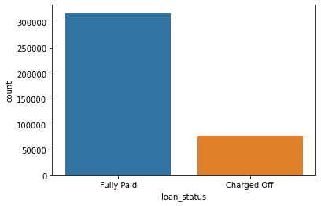
    

**TASK: Create a histogram of the loan_amnt column.**

    <AxesSubplot:xlabel='loan_amnt', ylabel='Count'>

    
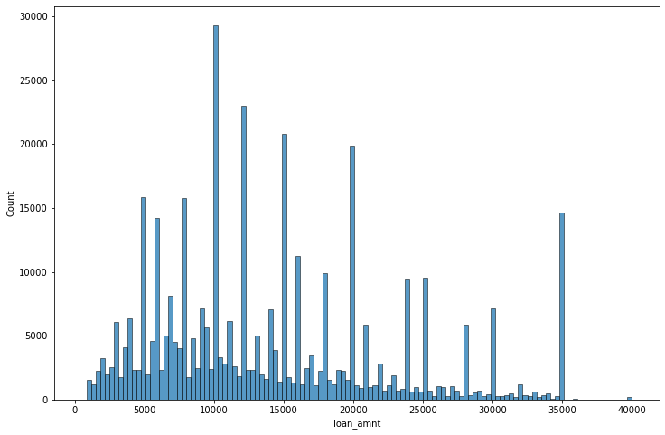
    

**TASK: Let's explore correlation between the continuous feature variables. Calculate the correlation between all continuous numeric variables using .corr() method.**

<table border="1" class="dataframe">
  <thead>
    <tr style="text-align: right;">
      <th></th>
      <th>loan_amnt</th>
      <th>int_rate</th>
      <th>installment</th>
      <th>annual_inc</th>
      <th>dti</th>
      <th>open_acc</th>
      <th>pub_rec</th>
      <th>revol_bal</th>
      <th>revol_util</th>
      <th>total_acc</th>
      <th>mort_acc</th>
      <th>pub_rec_bankruptcies</th>
    </tr>
  </thead>
  <tbody>
    <tr>
      <th>loan_amnt</th>
      <td>1.000000</td>
      <td>0.168921</td>
      <td>0.953929</td>
      <td>0.336887</td>
      <td>0.016636</td>
      <td>0.198556</td>
      <td>-0.077779</td>
      <td>0.328320</td>
      <td>0.099911</td>
      <td>0.223886</td>
      <td>0.222315</td>
      <td>-0.106539</td>
    </tr>
    <tr>
      <th>int_rate</th>
      <td>0.168921</td>
      <td>1.000000</td>
      <td>0.162758</td>
      <td>-0.056771</td>
      <td>0.079038</td>
      <td>0.011649</td>
      <td>0.060986</td>
      <td>-0.011280</td>
      <td>0.293659</td>
      <td>-0.036404</td>
      <td>-0.082583</td>
      <td>0.057450</td>
    </tr>
    <tr>
      <th>installment</th>
      <td>0.953929</td>
      <td>0.162758</td>
      <td>1.000000</td>
      <td>0.330381</td>
      <td>0.015786</td>
      <td>0.188973</td>
      <td>-0.067892</td>
      <td>0.316455</td>
      <td>0.123915</td>
      <td>0.202430</td>
      <td>0.193694</td>
      <td>-0.098628</td>
    </tr>
    <tr>
      <th>annual_inc</th>
      <td>0.336887</td>
      <td>-0.056771</td>
      <td>0.330381</td>
      <td>1.000000</td>
      <td>-0.081685</td>
      <td>0.136150</td>
      <td>-0.013720</td>
      <td>0.299773</td>
      <td>0.027871</td>
      <td>0.193023</td>
      <td>0.236320</td>
      <td>-0.050162</td>
    </tr>
    <tr>
      <th>dti</th>
      <td>0.016636</td>
      <td>0.079038</td>
      <td>0.015786</td>
      <td>-0.081685</td>
      <td>1.000000</td>
      <td>0.136181</td>
      <td>-0.017639</td>
      <td>0.063571</td>
      <td>0.088375</td>
      <td>0.102128</td>
      <td>-0.025439</td>
      <td>-0.014558</td>
    </tr>
    <tr>
      <th>open_acc</th>
      <td>0.198556</td>
      <td>0.011649</td>
      <td>0.188973</td>
      <td>0.136150</td>
      <td>0.136181</td>
      <td>1.000000</td>
      <td>-0.018392</td>
      <td>0.221192</td>
      <td>-0.131420</td>
      <td>0.680728</td>
      <td>0.109205</td>
      <td>-0.027732</td>
    </tr>
    <tr>
      <th>pub_rec</th>
      <td>-0.077779</td>
      <td>0.060986</td>
      <td>-0.067892</td>
      <td>-0.013720</td>
      <td>-0.017639</td>
      <td>-0.018392</td>
      <td>1.000000</td>
      <td>-0.101664</td>
      <td>-0.075910</td>
      <td>0.019723</td>
      <td>0.011552</td>
      <td>0.699408</td>
    </tr>
    <tr>
      <th>revol_bal</th>
      <td>0.328320</td>
      <td>-0.011280</td>
      <td>0.316455</td>
      <td>0.299773</td>
      <td>0.063571</td>
      <td>0.221192</td>
      <td>-0.101664</td>
      <td>1.000000</td>
      <td>0.226346</td>
      <td>0.191616</td>
      <td>0.194925</td>
      <td>-0.124532</td>
    </tr>
    <tr>
      <th>revol_util</th>
      <td>0.099911</td>
      <td>0.293659</td>
      <td>0.123915</td>
      <td>0.027871</td>
      <td>0.088375</td>
      <td>-0.131420</td>
      <td>-0.075910</td>
      <td>0.226346</td>
      <td>1.000000</td>
      <td>-0.104273</td>
      <td>0.007514</td>
      <td>-0.086751</td>
    </tr>
    <tr>
      <th>total_acc</th>
      <td>0.223886</td>
      <td>-0.036404</td>
      <td>0.202430</td>
      <td>0.193023</td>
      <td>0.102128</td>
      <td>0.680728</td>
      <td>0.019723</td>
      <td>0.191616</td>
      <td>-0.104273</td>
      <td>1.000000</td>
      <td>0.381072</td>
      <td>0.042035</td>
    </tr>
    <tr>
      <th>mort_acc</th>
      <td>0.222315</td>
      <td>-0.082583</td>
      <td>0.193694</td>
      <td>0.236320</td>
      <td>-0.025439</td>
      <td>0.109205</td>
      <td>0.011552</td>
      <td>0.194925</td>
      <td>0.007514</td>
      <td>0.381072</td>
      <td>1.000000</td>
      <td>0.027239</td>
    </tr>
    <tr>
      <th>pub_rec_bankruptcies</th>
      <td>-0.106539</td>
      <td>0.057450</td>
      <td>-0.098628</td>
      <td>-0.050162</td>
      <td>-0.014558</td>
      <td>-0.027732</td>
      <td>0.699408</td>
      <td>-0.124532</td>
      <td>-0.086751</td>
      <td>0.042035</td>
      <td>0.027239</td>
      <td>1.000000</td>
    </tr>
  </tbody>
</table>

**TASK: Visualize this using a heatmap. Depending on your version of matplotlib, you may need to manually adjust the heatmap.**

* [Heatmap info](https://seaborn.pydata.org/generated/seaborn.heatmap.html#seaborn.heatmap)
* [Help with resizing](https://stackoverflow.com/questions/56942670/matplotlib-seaborn-first-and-last-row-cut-in-half-of-heatmap-plot)

    <AxesSubplot:>

    
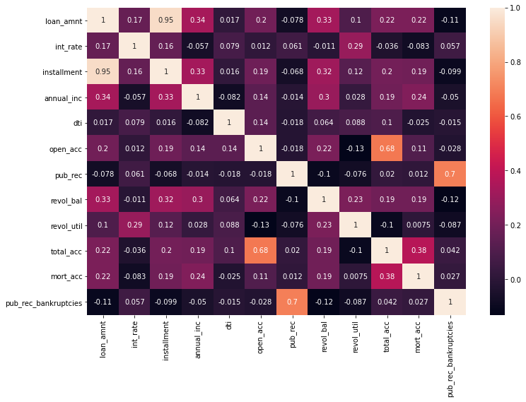
    

**TASK: You should have noticed almost perfect correlation with the "installment" feature. Explore this feature further. Print out their descriptions and perform a scatterplot between them. Does this relationship make sense to you? Do you think there is duplicate information here?**

    <AxesSubplot:xlabel='installment', ylabel='loan_amnt'>

    

    

    The monthly payment owed by the borrower if the loan originates.
    

    The listed amount of the loan applied for by the borrower. If at some point in time, the credit department reduces the loan amount, then it will be reflected in this value.
    

**TASK: Create a boxplot showing the relationship between the loan_status and the Loan Amount.**

    <AxesSubplot:xlabel='loan_status', ylabel='loan_amnt'>

    
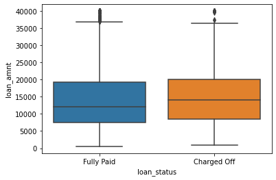
    

**TASK: Calculate the summary statistics for the loan amount, grouped by the loan_status.**

<table border="1" class="dataframe">
  <thead>
    <tr style="text-align: right;">
      <th></th>
      <th>count</th>
      <th>mean</th>
      <th>std</th>
      <th>min</th>
      <th>25%</th>
      <th>50%</th>
      <th>75%</th>
      <th>max</th>
    </tr>
    <tr>
      <th>loan_status</th>
      <th></th>
      <th></th>
      <th></th>
      <th></th>
      <th></th>
      <th></th>
      <th></th>
      <th></th>
    </tr>
  </thead>
  <tbody>
    <tr>
      <th>Charged Off</th>
      <td>77673.0</td>
      <td>15126.300967</td>
      <td>8505.090557</td>
      <td>1000.0</td>
      <td>8525.0</td>
      <td>14000.0</td>
      <td>20000.0</td>
      <td>40000.0</td>
    </tr>
    <tr>
      <th>Fully Paid</th>
      <td>318357.0</td>
      <td>13866.878771</td>
      <td>8302.319699</td>
      <td>500.0</td>
      <td>7500.0</td>
      <td>12000.0</td>
      <td>19225.0</td>
      <td>40000.0</td>
    </tr>
  </tbody>
</table>

**TASK: Let's explore the Grade and SubGrade columns that LendingClub attributes to the loans. What are the unique possible grades and subgrades?**

    array(['B', 'A', 'C', 'E', 'D', 'F', 'G'], dtype=object)

    array(['B4', 'B5', 'B3', 'A2', 'C5', 'C3', 'A1', 'B2', 'C1', 'A5', 'E4',
           'A4', 'A3', 'D1', 'C2', 'B1', 'D3', 'D5', 'D2', 'E1', 'E2', 'E5',
           'F4', 'E3', 'D4', 'G1', 'F5', 'G2', 'C4', 'F1', 'F3', 'G5', 'G4',
           'F2', 'G3'], dtype=object)

**TASK: Create a countplot per grade. Set the hue to the loan_status label.**

    C:\Users\Gholi002\Anaconda3\lib\site-packages\seaborn\_decorators.py:36: FutureWarning: Pass the following variable as a keyword arg: x. From version 0.12, the only valid positional argument will be `data`, and passing other arguments without an explicit keyword will result in an error or misinterpretation.
      warnings.warn(
    

    <AxesSubplot:xlabel='grade', ylabel='count'>

    
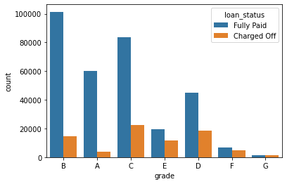
    

**TASK: Display a count plot per subgrade. You may need to resize for this plot and [reorder](https://seaborn.pydata.org/generated/seaborn.countplot.html#seaborn.countplot) the x axis. Feel free to edit the color palette. Explore both all loans made per subgrade as well being separated based on the loan_status. After creating this plot, go ahead and create a similar plot, but set hue="loan_status"**

    C:\Users\Gholi002\Anaconda3\lib\site-packages\seaborn\_decorators.py:36: FutureWarning: Pass the following variable as a keyword arg: x. From version 0.12, the only valid positional argument will be `data`, and passing other arguments without an explicit keyword will result in an error or misinterpretation.
      warnings.warn(
    

    <AxesSubplot:xlabel='sub_grade', ylabel='count'>

    
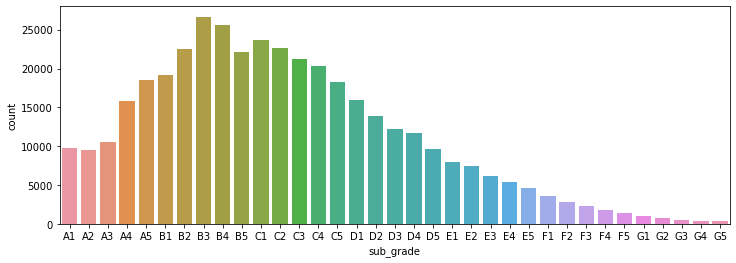
    

    C:\Users\Gholi002\Anaconda3\lib\site-packages\seaborn\_decorators.py:36: FutureWarning: Pass the following variable as a keyword arg: x. From version 0.12, the only valid positional argument will be `data`, and passing other arguments without an explicit keyword will result in an error or misinterpretation.
      warnings.warn(
    

    <AxesSubplot:xlabel='sub_grade', ylabel='count'>

    
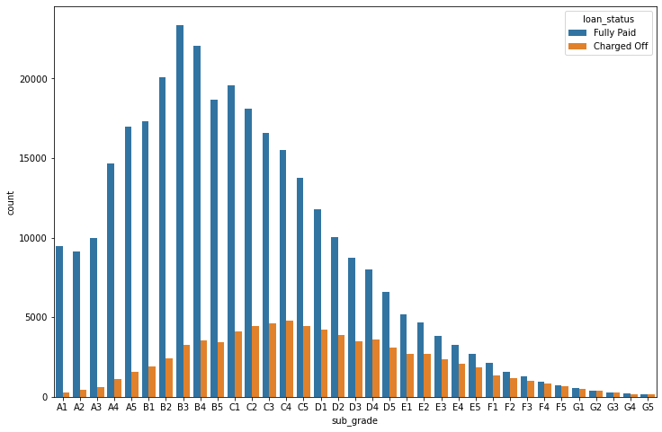
    

**TASK: It looks like F and G subgrades don't get paid back that often. Isloate those and recreate the countplot just for those subgrades.**

    C:\Users\Gholi002\Anaconda3\lib\site-packages\seaborn\_decorators.py:36: FutureWarning: Pass the following variable as a keyword arg: x. From version 0.12, the only valid positional argument will be `data`, and passing other arguments without an explicit keyword will result in an error or misinterpretation.
      warnings.warn(
    

    <AxesSubplot:xlabel='sub_grade', ylabel='count'>

    
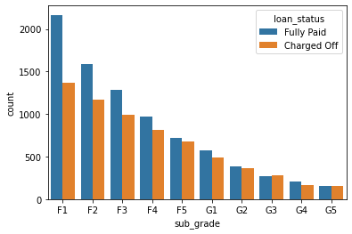
    

**TASK: Create a new column called 'loan_repaid' which will contain a 1 if the loan status was "Fully Paid" and a 0 if it was "Charged Off".**

    0    1
    1    1
    2    1
    3    1
    4    0
    Name: loan_repaid, dtype: int64

**CHALLENGE TASK: (Note this is hard, but can be done in one line!) Create a bar plot showing the correlation of the numeric features to the new loan_repaid column. [Helpful Link](https://pandas.pydata.org/pandas-docs/stable/reference/api/pandas.DataFrame.plot.bar.html)**

    <AxesSubplot:>

    
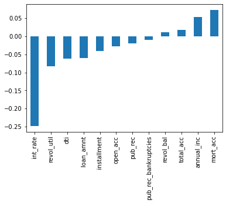
    

---
---
# Section 2: Data PreProcessing

**Section Goals: Remove or fill any missing data. Remove unnecessary or repetitive features. Convert categorical string features to dummy variables.**

<table border="1" class="dataframe">
  <thead>
    <tr style="text-align: right;">
      <th></th>
      <th>loan_amnt</th>
      <th>term</th>
      <th>int_rate</th>
      <th>installment</th>
      <th>grade</th>
      <th>sub_grade</th>
      <th>emp_title</th>
      <th>emp_length</th>
      <th>home_ownership</th>
      <th>annual_inc</th>
      <th>...</th>
      <th>pub_rec</th>
      <th>revol_bal</th>
      <th>revol_util</th>
      <th>total_acc</th>
      <th>initial_list_status</th>
      <th>application_type</th>
      <th>mort_acc</th>
      <th>pub_rec_bankruptcies</th>
      <th>address</th>
      <th>loan_repaid</th>
    </tr>
  </thead>
  <tbody>
    <tr>
      <th>0</th>
      <td>10000.0</td>
      <td>36 months</td>
      <td>11.44</td>
      <td>329.48</td>
      <td>B</td>
      <td>B4</td>
      <td>Marketing</td>
      <td>10+ years</td>
      <td>RENT</td>
      <td>117000.0</td>
      <td>...</td>
      <td>0.0</td>
      <td>36369.0</td>
      <td>41.8</td>
      <td>25.0</td>
      <td>w</td>
      <td>INDIVIDUAL</td>
      <td>0.0</td>
      <td>0.0</td>
      <td>0174 Michelle Gateway\r\nMendozaberg, OK 22690</td>
      <td>1</td>
    </tr>
    <tr>
      <th>1</th>
      <td>8000.0</td>
      <td>36 months</td>
      <td>11.99</td>
      <td>265.68</td>
      <td>B</td>
      <td>B5</td>
      <td>Credit analyst</td>
      <td>4 years</td>
      <td>MORTGAGE</td>
      <td>65000.0</td>
      <td>...</td>
      <td>0.0</td>
      <td>20131.0</td>
      <td>53.3</td>
      <td>27.0</td>
      <td>f</td>
      <td>INDIVIDUAL</td>
      <td>3.0</td>
      <td>0.0</td>
      <td>1076 Carney Fort Apt. 347\r\nLoganmouth, SD 05113</td>
      <td>1</td>
    </tr>
    <tr>
      <th>2</th>
      <td>15600.0</td>
      <td>36 months</td>
      <td>10.49</td>
      <td>506.97</td>
      <td>B</td>
      <td>B3</td>
      <td>Statistician</td>
      <td>&lt; 1 year</td>
      <td>RENT</td>
      <td>43057.0</td>
      <td>...</td>
      <td>0.0</td>
      <td>11987.0</td>
      <td>92.2</td>
      <td>26.0</td>
      <td>f</td>
      <td>INDIVIDUAL</td>
      <td>0.0</td>
      <td>0.0</td>
      <td>87025 Mark Dale Apt. 269\r\nNew Sabrina, WV 05113</td>
      <td>1</td>
    </tr>
    <tr>
      <th>3</th>
      <td>7200.0</td>
      <td>36 months</td>
      <td>6.49</td>
      <td>220.65</td>
      <td>A</td>
      <td>A2</td>
      <td>Client Advocate</td>
      <td>6 years</td>
      <td>RENT</td>
      <td>54000.0</td>
      <td>...</td>
      <td>0.0</td>
      <td>5472.0</td>
      <td>21.5</td>
      <td>13.0</td>
      <td>f</td>
      <td>INDIVIDUAL</td>
      <td>0.0</td>
      <td>0.0</td>
      <td>823 Reid Ford\r\nDelacruzside, MA 00813</td>
      <td>1</td>
    </tr>
    <tr>
      <th>4</th>
      <td>24375.0</td>
      <td>60 months</td>
      <td>17.27</td>
      <td>609.33</td>
      <td>C</td>
      <td>C5</td>
      <td>Destiny Management Inc.</td>
      <td>9 years</td>
      <td>MORTGAGE</td>
      <td>55000.0</td>
      <td>...</td>
      <td>0.0</td>
      <td>24584.0</td>
      <td>69.8</td>
      <td>43.0</td>
      <td>f</td>
      <td>INDIVIDUAL</td>
      <td>1.0</td>
      <td>0.0</td>
      <td>679 Luna Roads\r\nGreggshire, VA 11650</td>
      <td>0</td>
    </tr>
  </tbody>
</table>

5 rows × 28 columns

# Missing Data

**Let's explore this missing data columns. We use a variety of factors to decide whether or not they would be useful, to see if we should keep, discard, or fill in the missing data.**

**TASK: What is the length of the dataframe?**

    396030

**TASK: Create a Series that displays the total count of missing values per column.**

    loan_amnt                   0
    term                        0
    int_rate                    0
    installment                 0
    grade                       0
    sub_grade                   0
    emp_title               22927
    emp_length              18301
    home_ownership              0
    annual_inc                  0
    verification_status         0
    issue_d                     0
    loan_status                 0
    purpose                     0
    title                    1755
    dti                         0
    earliest_cr_line            0
    open_acc                    0
    pub_rec                     0
    revol_bal                   0
    revol_util                276
    total_acc                   0
    initial_list_status         0
    application_type            0
    mort_acc                37795
    pub_rec_bankruptcies      535
    address                     0
    loan_repaid                 0
    dtype: int64

**TASK: Convert this Series to be in term of percentage of the total DataFrame**

    loan_amnt               0.000000
    term                    0.000000
    int_rate                0.000000
    installment             0.000000
    grade                   0.000000
    sub_grade               0.000000
    emp_title               5.789208
    emp_length              4.621115
    home_ownership          0.000000
    annual_inc              0.000000
    verification_status     0.000000
    issue_d                 0.000000
    loan_status             0.000000
    purpose                 0.000000
    title                   0.443148
    dti                     0.000000
    earliest_cr_line        0.000000
    open_acc                0.000000
    pub_rec                 0.000000
    revol_bal               0.000000
    revol_util              0.069692
    total_acc               0.000000
    initial_list_status     0.000000
    application_type        0.000000
    mort_acc                9.543469
    pub_rec_bankruptcies    0.135091
    address                 0.000000
    loan_repaid             0.000000
    dtype: float64

**TASK: Let's examine emp_title and emp_length to see whether it will be okay to drop them. Print out their feature information using the feat_info() function from the top of this notebook.**

    Employment length in years. Possible values are between 0 and 10 where 0 means less than one year and 10 means ten or more years. 
    

    The job title supplied by the Borrower when applying for the loan.*
    

**TASK: How many unique employment job titles are there?**

    173105

**TASK: Realistically there are too many unique job titles to try to convert this to a dummy variable feature. Let's remove that emp_title column.**

**TASK: Create a count plot of the emp_length feature column. Challenge: Sort the order of the values.**

    ['1 year',
     '10+ years',
     '2 years',
     '3 years',
     '4 years',
     '5 years',
     '6 years',
     '7 years',
     '8 years',
     '9 years',
     '< 1 year']

    C:\Users\Gholi002\Anaconda3\lib\site-packages\seaborn\_decorators.py:36: FutureWarning: Pass the following variable as a keyword arg: x. From version 0.12, the only valid positional argument will be `data`, and passing other arguments without an explicit keyword will result in an error or misinterpretation.
      warnings.warn(
    

    <AxesSubplot:xlabel='emp_length', ylabel='count'>

    
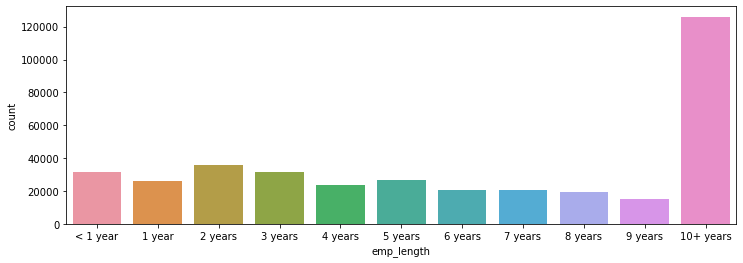
    

**TASK: Plot out the countplot with a hue separating Fully Paid vs Charged Off**

    C:\Users\Gholi002\Anaconda3\lib\site-packages\seaborn\_decorators.py:36: FutureWarning: Pass the following variable as a keyword arg: x. From version 0.12, the only valid positional argument will be `data`, and passing other arguments without an explicit keyword will result in an error or misinterpretation.
      warnings.warn(
    

    <AxesSubplot:xlabel='emp_length', ylabel='count'>

    
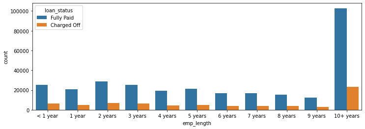
    

**CHALLENGE TASK: This still doesn't really inform us if there is a strong relationship between employment length and being charged off, what we want is the percentage of charge offs per category. Essentially informing us what percent of people per employment category didn't pay back their loan. There are a multitude of ways to create this Series. Once you've created it, see if visualize it with a [bar plot](https://pandas.pydata.org/pandas-docs/version/0.23.4/generated/pandas.DataFrame.plot.html). This may be tricky, refer to solutions if you get stuck on creating this Series.**

<table border="1" class="dataframe">
  <thead>
    <tr style="text-align: right;">
      <th></th>
      <th>loan_amnt</th>
      <th>term</th>
      <th>int_rate</th>
      <th>installment</th>
      <th>grade</th>
      <th>sub_grade</th>
      <th>home_ownership</th>
      <th>annual_inc</th>
      <th>verification_status</th>
      <th>issue_d</th>
      <th>...</th>
      <th>pub_rec</th>
      <th>revol_bal</th>
      <th>revol_util</th>
      <th>total_acc</th>
      <th>initial_list_status</th>
      <th>application_type</th>
      <th>mort_acc</th>
      <th>pub_rec_bankruptcies</th>
      <th>address</th>
      <th>loan_repaid</th>
    </tr>
    <tr>
      <th>emp_length</th>
      <th></th>
      <th></th>
      <th></th>
      <th></th>
      <th></th>
      <th></th>
      <th></th>
      <th></th>
      <th></th>
      <th></th>
      <th></th>
      <th></th>
      <th></th>
      <th></th>
      <th></th>
      <th></th>
      <th></th>
      <th></th>
      <th></th>
      <th></th>
      <th></th>
    </tr>
  </thead>
  <tbody>
    <tr>
      <th>1 year</th>
      <td>0.248649</td>
      <td>0.248649</td>
      <td>0.248649</td>
      <td>0.248649</td>
      <td>0.248649</td>
      <td>0.248649</td>
      <td>0.248649</td>
      <td>0.248649</td>
      <td>0.248649</td>
      <td>0.248649</td>
      <td>...</td>
      <td>0.248649</td>
      <td>0.248649</td>
      <td>0.248552</td>
      <td>0.248649</td>
      <td>0.248649</td>
      <td>0.248649</td>
      <td>0.261061</td>
      <td>0.248766</td>
      <td>0.248649</td>
      <td>0.248649</td>
    </tr>
    <tr>
      <th>10+ years</th>
      <td>0.225770</td>
      <td>0.225770</td>
      <td>0.225770</td>
      <td>0.225770</td>
      <td>0.225770</td>
      <td>0.225770</td>
      <td>0.225770</td>
      <td>0.225770</td>
      <td>0.225770</td>
      <td>0.225770</td>
      <td>...</td>
      <td>0.225770</td>
      <td>0.225770</td>
      <td>0.225756</td>
      <td>0.225770</td>
      <td>0.225770</td>
      <td>0.225770</td>
      <td>0.229115</td>
      <td>0.225765</td>
      <td>0.225770</td>
      <td>0.225770</td>
    </tr>
    <tr>
      <th>2 years</th>
      <td>0.239560</td>
      <td>0.239560</td>
      <td>0.239560</td>
      <td>0.239560</td>
      <td>0.239560</td>
      <td>0.239560</td>
      <td>0.239560</td>
      <td>0.239560</td>
      <td>0.239560</td>
      <td>0.239560</td>
      <td>...</td>
      <td>0.239560</td>
      <td>0.239560</td>
      <td>0.239493</td>
      <td>0.239560</td>
      <td>0.239560</td>
      <td>0.239560</td>
      <td>0.251745</td>
      <td>0.239739</td>
      <td>0.239560</td>
      <td>0.239560</td>
    </tr>
    <tr>
      <th>3 years</th>
      <td>0.242593</td>
      <td>0.242593</td>
      <td>0.242593</td>
      <td>0.242593</td>
      <td>0.242593</td>
      <td>0.242593</td>
      <td>0.242593</td>
      <td>0.242593</td>
      <td>0.242593</td>
      <td>0.242593</td>
      <td>...</td>
      <td>0.242593</td>
      <td>0.242593</td>
      <td>0.242618</td>
      <td>0.242593</td>
      <td>0.242593</td>
      <td>0.242593</td>
      <td>0.254725</td>
      <td>0.242914</td>
      <td>0.242593</td>
      <td>0.242593</td>
    </tr>
    <tr>
      <th>4 years</th>
      <td>0.238213</td>
      <td>0.238213</td>
      <td>0.238213</td>
      <td>0.238213</td>
      <td>0.238213</td>
      <td>0.238213</td>
      <td>0.238213</td>
      <td>0.238213</td>
      <td>0.238213</td>
      <td>0.238213</td>
      <td>...</td>
      <td>0.238213</td>
      <td>0.238213</td>
      <td>0.238090</td>
      <td>0.238213</td>
      <td>0.238213</td>
      <td>0.238213</td>
      <td>0.250514</td>
      <td>0.237979</td>
      <td>0.238213</td>
      <td>0.238213</td>
    </tr>
    <tr>
      <th>5 years</th>
      <td>0.237911</td>
      <td>0.237911</td>
      <td>0.237911</td>
      <td>0.237911</td>
      <td>0.237911</td>
      <td>0.237911</td>
      <td>0.237911</td>
      <td>0.237911</td>
      <td>0.237911</td>
      <td>0.237911</td>
      <td>...</td>
      <td>0.237911</td>
      <td>0.237911</td>
      <td>0.237857</td>
      <td>0.237911</td>
      <td>0.237911</td>
      <td>0.237911</td>
      <td>0.249639</td>
      <td>0.238062</td>
      <td>0.237911</td>
      <td>0.237911</td>
    </tr>
    <tr>
      <th>6 years</th>
      <td>0.233341</td>
      <td>0.233341</td>
      <td>0.233341</td>
      <td>0.233341</td>
      <td>0.233341</td>
      <td>0.233341</td>
      <td>0.233341</td>
      <td>0.233341</td>
      <td>0.233341</td>
      <td>0.233341</td>
      <td>...</td>
      <td>0.233341</td>
      <td>0.233341</td>
      <td>0.233475</td>
      <td>0.233341</td>
      <td>0.233341</td>
      <td>0.233341</td>
      <td>0.242568</td>
      <td>0.233440</td>
      <td>0.233341</td>
      <td>0.233341</td>
    </tr>
    <tr>
      <th>7 years</th>
      <td>0.241887</td>
      <td>0.241887</td>
      <td>0.241887</td>
      <td>0.241887</td>
      <td>0.241887</td>
      <td>0.241887</td>
      <td>0.241887</td>
      <td>0.241887</td>
      <td>0.241887</td>
      <td>0.241887</td>
      <td>...</td>
      <td>0.241887</td>
      <td>0.241887</td>
      <td>0.241954</td>
      <td>0.241887</td>
      <td>0.241887</td>
      <td>0.241887</td>
      <td>0.246663</td>
      <td>0.241896</td>
      <td>0.241887</td>
      <td>0.241887</td>
    </tr>
    <tr>
      <th>8 years</th>
      <td>0.249625</td>
      <td>0.249625</td>
      <td>0.249625</td>
      <td>0.249625</td>
      <td>0.249625</td>
      <td>0.249625</td>
      <td>0.249625</td>
      <td>0.249625</td>
      <td>0.249625</td>
      <td>0.249625</td>
      <td>...</td>
      <td>0.249625</td>
      <td>0.249625</td>
      <td>0.249429</td>
      <td>0.249625</td>
      <td>0.249625</td>
      <td>0.249625</td>
      <td>0.255197</td>
      <td>0.249690</td>
      <td>0.249625</td>
      <td>0.249625</td>
    </tr>
    <tr>
      <th>9 years</th>
      <td>0.250735</td>
      <td>0.250735</td>
      <td>0.250735</td>
      <td>0.250735</td>
      <td>0.250735</td>
      <td>0.250735</td>
      <td>0.250735</td>
      <td>0.250735</td>
      <td>0.250735</td>
      <td>0.250735</td>
      <td>...</td>
      <td>0.250735</td>
      <td>0.250735</td>
      <td>0.250756</td>
      <td>0.250735</td>
      <td>0.250735</td>
      <td>0.250735</td>
      <td>0.259382</td>
      <td>0.250797</td>
      <td>0.250735</td>
      <td>0.250735</td>
    </tr>
    <tr>
      <th>&lt; 1 year</th>
      <td>0.260830</td>
      <td>0.260830</td>
      <td>0.260830</td>
      <td>0.260830</td>
      <td>0.260830</td>
      <td>0.260830</td>
      <td>0.260830</td>
      <td>0.260830</td>
      <td>0.260830</td>
      <td>0.260830</td>
      <td>...</td>
      <td>0.260830</td>
      <td>0.260830</td>
      <td>0.260750</td>
      <td>0.260830</td>
      <td>0.260830</td>
      <td>0.260830</td>
      <td>0.274030</td>
      <td>0.261026</td>
      <td>0.260830</td>
      <td>0.260830</td>
    </tr>
  </tbody>
</table>

11 rows × 26 columns

    <AxesSubplot:xlabel='emp_length'>

    
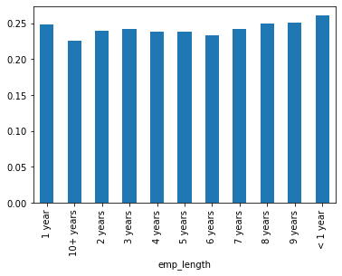
    

**TASK: Charge off rates are extremely similar across all employment lengths. Go ahead and drop the emp_length column.**

<table border="1" class="dataframe">
  <thead>
    <tr style="text-align: right;">
      <th></th>
      <th>loan_amnt</th>
      <th>term</th>
      <th>int_rate</th>
      <th>installment</th>
      <th>grade</th>
      <th>sub_grade</th>
      <th>home_ownership</th>
      <th>annual_inc</th>
      <th>verification_status</th>
      <th>issue_d</th>
      <th>...</th>
      <th>pub_rec</th>
      <th>revol_bal</th>
      <th>revol_util</th>
      <th>total_acc</th>
      <th>initial_list_status</th>
      <th>application_type</th>
      <th>mort_acc</th>
      <th>pub_rec_bankruptcies</th>
      <th>address</th>
      <th>loan_repaid</th>
    </tr>
  </thead>
  <tbody>
    <tr>
      <th>0</th>
      <td>10000.0</td>
      <td>36 months</td>
      <td>11.44</td>
      <td>329.48</td>
      <td>B</td>
      <td>B4</td>
      <td>RENT</td>
      <td>117000.0</td>
      <td>Not Verified</td>
      <td>Jan-2015</td>
      <td>...</td>
      <td>0.0</td>
      <td>36369.0</td>
      <td>41.8</td>
      <td>25.0</td>
      <td>w</td>
      <td>INDIVIDUAL</td>
      <td>0.0</td>
      <td>0.0</td>
      <td>0174 Michelle Gateway\r\nMendozaberg, OK 22690</td>
      <td>1</td>
    </tr>
    <tr>
      <th>1</th>
      <td>8000.0</td>
      <td>36 months</td>
      <td>11.99</td>
      <td>265.68</td>
      <td>B</td>
      <td>B5</td>
      <td>MORTGAGE</td>
      <td>65000.0</td>
      <td>Not Verified</td>
      <td>Jan-2015</td>
      <td>...</td>
      <td>0.0</td>
      <td>20131.0</td>
      <td>53.3</td>
      <td>27.0</td>
      <td>f</td>
      <td>INDIVIDUAL</td>
      <td>3.0</td>
      <td>0.0</td>
      <td>1076 Carney Fort Apt. 347\r\nLoganmouth, SD 05113</td>
      <td>1</td>
    </tr>
    <tr>
      <th>2</th>
      <td>15600.0</td>
      <td>36 months</td>
      <td>10.49</td>
      <td>506.97</td>
      <td>B</td>
      <td>B3</td>
      <td>RENT</td>
      <td>43057.0</td>
      <td>Source Verified</td>
      <td>Jan-2015</td>
      <td>...</td>
      <td>0.0</td>
      <td>11987.0</td>
      <td>92.2</td>
      <td>26.0</td>
      <td>f</td>
      <td>INDIVIDUAL</td>
      <td>0.0</td>
      <td>0.0</td>
      <td>87025 Mark Dale Apt. 269\r\nNew Sabrina, WV 05113</td>
      <td>1</td>
    </tr>
    <tr>
      <th>3</th>
      <td>7200.0</td>
      <td>36 months</td>
      <td>6.49</td>
      <td>220.65</td>
      <td>A</td>
      <td>A2</td>
      <td>RENT</td>
      <td>54000.0</td>
      <td>Not Verified</td>
      <td>Nov-2014</td>
      <td>...</td>
      <td>0.0</td>
      <td>5472.0</td>
      <td>21.5</td>
      <td>13.0</td>
      <td>f</td>
      <td>INDIVIDUAL</td>
      <td>0.0</td>
      <td>0.0</td>
      <td>823 Reid Ford\r\nDelacruzside, MA 00813</td>
      <td>1</td>
    </tr>
    <tr>
      <th>4</th>
      <td>24375.0</td>
      <td>60 months</td>
      <td>17.27</td>
      <td>609.33</td>
      <td>C</td>
      <td>C5</td>
      <td>MORTGAGE</td>
      <td>55000.0</td>
      <td>Verified</td>
      <td>Apr-2013</td>
      <td>...</td>
      <td>0.0</td>
      <td>24584.0</td>
      <td>69.8</td>
      <td>43.0</td>
      <td>f</td>
      <td>INDIVIDUAL</td>
      <td>1.0</td>
      <td>0.0</td>
      <td>679 Luna Roads\r\nGreggshire, VA 11650</td>
      <td>0</td>
    </tr>
    <tr>
      <th>...</th>
      <td>...</td>
      <td>...</td>
      <td>...</td>
      <td>...</td>
      <td>...</td>
      <td>...</td>
      <td>...</td>
      <td>...</td>
      <td>...</td>
      <td>...</td>
      <td>...</td>
      <td>...</td>
      <td>...</td>
      <td>...</td>
      <td>...</td>
      <td>...</td>
      <td>...</td>
      <td>...</td>
      <td>...</td>
      <td>...</td>
      <td>...</td>
    </tr>
    <tr>
      <th>396025</th>
      <td>10000.0</td>
      <td>60 months</td>
      <td>10.99</td>
      <td>217.38</td>
      <td>B</td>
      <td>B4</td>
      <td>RENT</td>
      <td>40000.0</td>
      <td>Source Verified</td>
      <td>Oct-2015</td>
      <td>...</td>
      <td>0.0</td>
      <td>1990.0</td>
      <td>34.3</td>
      <td>23.0</td>
      <td>w</td>
      <td>INDIVIDUAL</td>
      <td>0.0</td>
      <td>0.0</td>
      <td>12951 Williams Crossing\r\nJohnnyville, DC 30723</td>
      <td>1</td>
    </tr>
    <tr>
      <th>396026</th>
      <td>21000.0</td>
      <td>36 months</td>
      <td>12.29</td>
      <td>700.42</td>
      <td>C</td>
      <td>C1</td>
      <td>MORTGAGE</td>
      <td>110000.0</td>
      <td>Source Verified</td>
      <td>Feb-2015</td>
      <td>...</td>
      <td>0.0</td>
      <td>43263.0</td>
      <td>95.7</td>
      <td>8.0</td>
      <td>f</td>
      <td>INDIVIDUAL</td>
      <td>1.0</td>
      <td>0.0</td>
      <td>0114 Fowler Field Suite 028\r\nRachelborough, ...</td>
      <td>1</td>
    </tr>
    <tr>
      <th>396027</th>
      <td>5000.0</td>
      <td>36 months</td>
      <td>9.99</td>
      <td>161.32</td>
      <td>B</td>
      <td>B1</td>
      <td>RENT</td>
      <td>56500.0</td>
      <td>Verified</td>
      <td>Oct-2013</td>
      <td>...</td>
      <td>0.0</td>
      <td>32704.0</td>
      <td>66.9</td>
      <td>23.0</td>
      <td>f</td>
      <td>INDIVIDUAL</td>
      <td>0.0</td>
      <td>0.0</td>
      <td>953 Matthew Points Suite 414\r\nReedfort, NY 7...</td>
      <td>1</td>
    </tr>
    <tr>
      <th>396028</th>
      <td>21000.0</td>
      <td>60 months</td>
      <td>15.31</td>
      <td>503.02</td>
      <td>C</td>
      <td>C2</td>
      <td>MORTGAGE</td>
      <td>64000.0</td>
      <td>Verified</td>
      <td>Aug-2012</td>
      <td>...</td>
      <td>0.0</td>
      <td>15704.0</td>
      <td>53.8</td>
      <td>20.0</td>
      <td>f</td>
      <td>INDIVIDUAL</td>
      <td>5.0</td>
      <td>0.0</td>
      <td>7843 Blake Freeway Apt. 229\r\nNew Michael, FL...</td>
      <td>1</td>
    </tr>
    <tr>
      <th>396029</th>
      <td>2000.0</td>
      <td>36 months</td>
      <td>13.61</td>
      <td>67.98</td>
      <td>C</td>
      <td>C2</td>
      <td>RENT</td>
      <td>42996.0</td>
      <td>Verified</td>
      <td>Jun-2010</td>
      <td>...</td>
      <td>0.0</td>
      <td>4292.0</td>
      <td>91.3</td>
      <td>19.0</td>
      <td>f</td>
      <td>INDIVIDUAL</td>
      <td>NaN</td>
      <td>0.0</td>
      <td>787 Michelle Causeway\r\nBriannaton, AR 48052</td>
      <td>1</td>
    </tr>
  </tbody>
</table>

396030 rows × 26 columns

**TASK: Revisit the DataFrame to see what feature columns still have missing data.**

    loan_amnt                   0
    term                        0
    int_rate                    0
    installment                 0
    grade                       0
    sub_grade                   0
    home_ownership              0
    annual_inc                  0
    verification_status         0
    issue_d                     0
    loan_status                 0
    purpose                     0
    title                    1755
    dti                         0
    earliest_cr_line            0
    open_acc                    0
    pub_rec                     0
    revol_bal                   0
    revol_util                276
    total_acc                   0
    initial_list_status         0
    application_type            0
    mort_acc                37795
    pub_rec_bankruptcies      535
    address                     0
    loan_repaid                 0
    dtype: int64

**TASK: Review the title column vs the purpose column. Is this repeated information?**

    False

    0              vacation
    1    debt_consolidation
    2           credit_card
    3           credit_card
    4           credit_card
    5    debt_consolidation
    6      home_improvement
    7           credit_card
    8    debt_consolidation
    9    debt_consolidation
    Name: purpose, dtype: object

    0                   Vacation
    1         Debt consolidation
    2    Credit card refinancing
    3    Credit card refinancing
    4      Credit Card Refinance
    5         Debt consolidation
    6           Home improvement
    7       No More Credit Cards
    8         Debt consolidation
    9         Debt Consolidation
    Name: title, dtype: object

**TASK: The title column is simply a string subcategory/description of the purpose column. Go ahead and drop the title column.**

---
**NOTE: This is one of the hardest parts of the project! Refer to the solutions video if you need guidance, feel free to fill or drop the missing values of the mort_acc however you see fit! Here we're going with a very specific approach.**

---
**TASK: Find out what the mort_acc feature represents**

    Number of mortgage accounts.
    

**TASK: Create a value_counts of the mort_acc column.**

    0.0     139777
    1.0      60416
    2.0      49948
    3.0      38049
    4.0      27887
    5.0      18194
    6.0      11069
    7.0       6052
    8.0       3121
    9.0       1656
    10.0       865
    11.0       479
    12.0       264
    13.0       146
    14.0       107
    15.0        61
    16.0        37
    17.0        22
    18.0        18
    19.0        15
    20.0        13
    24.0        10
    22.0         7
    21.0         4
    25.0         4
    27.0         3
    23.0         2
    32.0         2
    26.0         2
    31.0         2
    30.0         1
    28.0         1
    34.0         1
    Name: mort_acc, dtype: int64

**TASK: There are many ways we could deal with this missing data. We could attempt to build a simple model to fill it in, such as a linear model, we could just fill it in based on the mean of the other columns, or you could even bin the columns into categories and then set NaN as its own category. There is no 100% correct approach! Let's review the other columsn to see which most highly correlates to mort_acc**

    int_rate               -0.082583
    dti                    -0.025439
    revol_util              0.007514
    pub_rec                 0.011552
    pub_rec_bankruptcies    0.027239
    loan_repaid             0.073111
    open_acc                0.109205
    installment             0.193694
    revol_bal               0.194925
    loan_amnt               0.222315
    annual_inc              0.236320
    total_acc               0.381072
    mort_acc                1.000000
    Name: mort_acc, dtype: float64

**TASK: Looks like the total_acc feature correlates with the mort_acc , this makes sense! Let's try this fillna() approach. We will group the dataframe by the total_acc and calculate the mean value for the mort_acc per total_acc entry. To get the result below:**

**CHALLENGE TASK: Let's fill in the missing mort_acc values based on their total_acc value. If the mort_acc is missing, then we will fill in that missing value with the mean value corresponding to its total_acc value from the Series we created above. This involves using an .apply() method with two columns. Check out the link below for more info, or review the solutions video/notebook.**

[Helpful Link](https://stackoverflow.com/questions/13331698/how-to-apply-a-function-to-two-columns-of-pandas-dataframe) 

    0         0.000000
    1         3.000000
    2         0.000000
    3         0.000000
    4         1.000000
                ...   
    396025    0.000000
    396026    1.000000
    396027    0.000000
    396028    5.000000
    396029    1.358013
    Name: mort_acc, Length: 396030, dtype: float64

    0

**TASK: revol_util and the pub_rec_bankruptcies have missing data points, but they account for less than 0.5% of the total data. Go ahead and remove the rows that are missing those values in those columns with dropna().**

<table border="1" class="dataframe">
  <thead>
    <tr style="text-align: right;">
      <th></th>
      <th>loan_amnt</th>
      <th>term</th>
      <th>int_rate</th>
      <th>installment</th>
      <th>grade</th>
      <th>sub_grade</th>
      <th>home_ownership</th>
      <th>annual_inc</th>
      <th>verification_status</th>
      <th>issue_d</th>
      <th>...</th>
      <th>pub_rec</th>
      <th>revol_bal</th>
      <th>revol_util</th>
      <th>total_acc</th>
      <th>initial_list_status</th>
      <th>application_type</th>
      <th>mort_acc</th>
      <th>pub_rec_bankruptcies</th>
      <th>address</th>
      <th>loan_repaid</th>
    </tr>
  </thead>
  <tbody>
    <tr>
      <th>0</th>
      <td>10000.0</td>
      <td>36 months</td>
      <td>11.44</td>
      <td>329.48</td>
      <td>B</td>
      <td>B4</td>
      <td>RENT</td>
      <td>117000.0</td>
      <td>Not Verified</td>
      <td>Jan-2015</td>
      <td>...</td>
      <td>0.0</td>
      <td>36369.0</td>
      <td>41.8</td>
      <td>25.0</td>
      <td>w</td>
      <td>INDIVIDUAL</td>
      <td>0.000000</td>
      <td>0.0</td>
      <td>0174 Michelle Gateway\r\nMendozaberg, OK 22690</td>
      <td>1</td>
    </tr>
    <tr>
      <th>1</th>
      <td>8000.0</td>
      <td>36 months</td>
      <td>11.99</td>
      <td>265.68</td>
      <td>B</td>
      <td>B5</td>
      <td>MORTGAGE</td>
      <td>65000.0</td>
      <td>Not Verified</td>
      <td>Jan-2015</td>
      <td>...</td>
      <td>0.0</td>
      <td>20131.0</td>
      <td>53.3</td>
      <td>27.0</td>
      <td>f</td>
      <td>INDIVIDUAL</td>
      <td>3.000000</td>
      <td>0.0</td>
      <td>1076 Carney Fort Apt. 347\r\nLoganmouth, SD 05113</td>
      <td>1</td>
    </tr>
    <tr>
      <th>2</th>
      <td>15600.0</td>
      <td>36 months</td>
      <td>10.49</td>
      <td>506.97</td>
      <td>B</td>
      <td>B3</td>
      <td>RENT</td>
      <td>43057.0</td>
      <td>Source Verified</td>
      <td>Jan-2015</td>
      <td>...</td>
      <td>0.0</td>
      <td>11987.0</td>
      <td>92.2</td>
      <td>26.0</td>
      <td>f</td>
      <td>INDIVIDUAL</td>
      <td>0.000000</td>
      <td>0.0</td>
      <td>87025 Mark Dale Apt. 269\r\nNew Sabrina, WV 05113</td>
      <td>1</td>
    </tr>
    <tr>
      <th>3</th>
      <td>7200.0</td>
      <td>36 months</td>
      <td>6.49</td>
      <td>220.65</td>
      <td>A</td>
      <td>A2</td>
      <td>RENT</td>
      <td>54000.0</td>
      <td>Not Verified</td>
      <td>Nov-2014</td>
      <td>...</td>
      <td>0.0</td>
      <td>5472.0</td>
      <td>21.5</td>
      <td>13.0</td>
      <td>f</td>
      <td>INDIVIDUAL</td>
      <td>0.000000</td>
      <td>0.0</td>
      <td>823 Reid Ford\r\nDelacruzside, MA 00813</td>
      <td>1</td>
    </tr>
    <tr>
      <th>4</th>
      <td>24375.0</td>
      <td>60 months</td>
      <td>17.27</td>
      <td>609.33</td>
      <td>C</td>
      <td>C5</td>
      <td>MORTGAGE</td>
      <td>55000.0</td>
      <td>Verified</td>
      <td>Apr-2013</td>
      <td>...</td>
      <td>0.0</td>
      <td>24584.0</td>
      <td>69.8</td>
      <td>43.0</td>
      <td>f</td>
      <td>INDIVIDUAL</td>
      <td>1.000000</td>
      <td>0.0</td>
      <td>679 Luna Roads\r\nGreggshire, VA 11650</td>
      <td>0</td>
    </tr>
    <tr>
      <th>...</th>
      <td>...</td>
      <td>...</td>
      <td>...</td>
      <td>...</td>
      <td>...</td>
      <td>...</td>
      <td>...</td>
      <td>...</td>
      <td>...</td>
      <td>...</td>
      <td>...</td>
      <td>...</td>
      <td>...</td>
      <td>...</td>
      <td>...</td>
      <td>...</td>
      <td>...</td>
      <td>...</td>
      <td>...</td>
      <td>...</td>
      <td>...</td>
    </tr>
    <tr>
      <th>396025</th>
      <td>10000.0</td>
      <td>60 months</td>
      <td>10.99</td>
      <td>217.38</td>
      <td>B</td>
      <td>B4</td>
      <td>RENT</td>
      <td>40000.0</td>
      <td>Source Verified</td>
      <td>Oct-2015</td>
      <td>...</td>
      <td>0.0</td>
      <td>1990.0</td>
      <td>34.3</td>
      <td>23.0</td>
      <td>w</td>
      <td>INDIVIDUAL</td>
      <td>0.000000</td>
      <td>0.0</td>
      <td>12951 Williams Crossing\r\nJohnnyville, DC 30723</td>
      <td>1</td>
    </tr>
    <tr>
      <th>396026</th>
      <td>21000.0</td>
      <td>36 months</td>
      <td>12.29</td>
      <td>700.42</td>
      <td>C</td>
      <td>C1</td>
      <td>MORTGAGE</td>
      <td>110000.0</td>
      <td>Source Verified</td>
      <td>Feb-2015</td>
      <td>...</td>
      <td>0.0</td>
      <td>43263.0</td>
      <td>95.7</td>
      <td>8.0</td>
      <td>f</td>
      <td>INDIVIDUAL</td>
      <td>1.000000</td>
      <td>0.0</td>
      <td>0114 Fowler Field Suite 028\r\nRachelborough, ...</td>
      <td>1</td>
    </tr>
    <tr>
      <th>396027</th>
      <td>5000.0</td>
      <td>36 months</td>
      <td>9.99</td>
      <td>161.32</td>
      <td>B</td>
      <td>B1</td>
      <td>RENT</td>
      <td>56500.0</td>
      <td>Verified</td>
      <td>Oct-2013</td>
      <td>...</td>
      <td>0.0</td>
      <td>32704.0</td>
      <td>66.9</td>
      <td>23.0</td>
      <td>f</td>
      <td>INDIVIDUAL</td>
      <td>0.000000</td>
      <td>0.0</td>
      <td>953 Matthew Points Suite 414\r\nReedfort, NY 7...</td>
      <td>1</td>
    </tr>
    <tr>
      <th>396028</th>
      <td>21000.0</td>
      <td>60 months</td>
      <td>15.31</td>
      <td>503.02</td>
      <td>C</td>
      <td>C2</td>
      <td>MORTGAGE</td>
      <td>64000.0</td>
      <td>Verified</td>
      <td>Aug-2012</td>
      <td>...</td>
      <td>0.0</td>
      <td>15704.0</td>
      <td>53.8</td>
      <td>20.0</td>
      <td>f</td>
      <td>INDIVIDUAL</td>
      <td>5.000000</td>
      <td>0.0</td>
      <td>7843 Blake Freeway Apt. 229\r\nNew Michael, FL...</td>
      <td>1</td>
    </tr>
    <tr>
      <th>396029</th>
      <td>2000.0</td>
      <td>36 months</td>
      <td>13.61</td>
      <td>67.98</td>
      <td>C</td>
      <td>C2</td>
      <td>RENT</td>
      <td>42996.0</td>
      <td>Verified</td>
      <td>Jun-2010</td>
      <td>...</td>
      <td>0.0</td>
      <td>4292.0</td>
      <td>91.3</td>
      <td>19.0</td>
      <td>f</td>
      <td>INDIVIDUAL</td>
      <td>1.358013</td>
      <td>0.0</td>
      <td>787 Michelle Causeway\r\nBriannaton, AR 48052</td>
      <td>1</td>
    </tr>
  </tbody>
</table>

395219 rows × 25 columns

## Categorical Variables and Dummy Variables

**We're done working with the missing data! Now we just need to deal with the string values due to the categorical columns.**

**TASK: List all the columns that are currently non-numeric. [Helpful Link](https://stackoverflow.com/questions/22470690/get-list-of-pandas-dataframe-columns-based-on-data-type)**

[Another very useful method call](https://pandas.pydata.org/pandas-docs/stable/reference/api/pandas.DataFrame.select_dtypes.html)

<table border="1" class="dataframe">
  <thead>
    <tr style="text-align: right;">
      <th></th>
      <th>term</th>
      <th>grade</th>
      <th>sub_grade</th>
      <th>home_ownership</th>
      <th>verification_status</th>
      <th>issue_d</th>
      <th>loan_status</th>
      <th>purpose</th>
      <th>earliest_cr_line</th>
      <th>initial_list_status</th>
      <th>application_type</th>
      <th>address</th>
    </tr>
  </thead>
  <tbody>
    <tr>
      <th>0</th>
      <td>36 months</td>
      <td>B</td>
      <td>B4</td>
      <td>RENT</td>
      <td>Not Verified</td>
      <td>Jan-2015</td>
      <td>Fully Paid</td>
      <td>vacation</td>
      <td>Jun-1990</td>
      <td>w</td>
      <td>INDIVIDUAL</td>
      <td>0174 Michelle Gateway\r\nMendozaberg, OK 22690</td>
    </tr>
    <tr>
      <th>1</th>
      <td>36 months</td>
      <td>B</td>
      <td>B5</td>
      <td>MORTGAGE</td>
      <td>Not Verified</td>
      <td>Jan-2015</td>
      <td>Fully Paid</td>
      <td>debt_consolidation</td>
      <td>Jul-2004</td>
      <td>f</td>
      <td>INDIVIDUAL</td>
      <td>1076 Carney Fort Apt. 347\r\nLoganmouth, SD 05113</td>
    </tr>
    <tr>
      <th>2</th>
      <td>36 months</td>
      <td>B</td>
      <td>B3</td>
      <td>RENT</td>
      <td>Source Verified</td>
      <td>Jan-2015</td>
      <td>Fully Paid</td>
      <td>credit_card</td>
      <td>Aug-2007</td>
      <td>f</td>
      <td>INDIVIDUAL</td>
      <td>87025 Mark Dale Apt. 269\r\nNew Sabrina, WV 05113</td>
    </tr>
    <tr>
      <th>3</th>
      <td>36 months</td>
      <td>A</td>
      <td>A2</td>
      <td>RENT</td>
      <td>Not Verified</td>
      <td>Nov-2014</td>
      <td>Fully Paid</td>
      <td>credit_card</td>
      <td>Sep-2006</td>
      <td>f</td>
      <td>INDIVIDUAL</td>
      <td>823 Reid Ford\r\nDelacruzside, MA 00813</td>
    </tr>
    <tr>
      <th>4</th>
      <td>60 months</td>
      <td>C</td>
      <td>C5</td>
      <td>MORTGAGE</td>
      <td>Verified</td>
      <td>Apr-2013</td>
      <td>Charged Off</td>
      <td>credit_card</td>
      <td>Mar-1999</td>
      <td>f</td>
      <td>INDIVIDUAL</td>
      <td>679 Luna Roads\r\nGreggshire, VA 11650</td>
    </tr>
    <tr>
      <th>...</th>
      <td>...</td>
      <td>...</td>
      <td>...</td>
      <td>...</td>
      <td>...</td>
      <td>...</td>
      <td>...</td>
      <td>...</td>
      <td>...</td>
      <td>...</td>
      <td>...</td>
      <td>...</td>
    </tr>
    <tr>
      <th>396025</th>
      <td>60 months</td>
      <td>B</td>
      <td>B4</td>
      <td>RENT</td>
      <td>Source Verified</td>
      <td>Oct-2015</td>
      <td>Fully Paid</td>
      <td>debt_consolidation</td>
      <td>Nov-2004</td>
      <td>w</td>
      <td>INDIVIDUAL</td>
      <td>12951 Williams Crossing\r\nJohnnyville, DC 30723</td>
    </tr>
    <tr>
      <th>396026</th>
      <td>36 months</td>
      <td>C</td>
      <td>C1</td>
      <td>MORTGAGE</td>
      <td>Source Verified</td>
      <td>Feb-2015</td>
      <td>Fully Paid</td>
      <td>debt_consolidation</td>
      <td>Feb-2006</td>
      <td>f</td>
      <td>INDIVIDUAL</td>
      <td>0114 Fowler Field Suite 028\r\nRachelborough, ...</td>
    </tr>
    <tr>
      <th>396027</th>
      <td>36 months</td>
      <td>B</td>
      <td>B1</td>
      <td>RENT</td>
      <td>Verified</td>
      <td>Oct-2013</td>
      <td>Fully Paid</td>
      <td>debt_consolidation</td>
      <td>Mar-1997</td>
      <td>f</td>
      <td>INDIVIDUAL</td>
      <td>953 Matthew Points Suite 414\r\nReedfort, NY 7...</td>
    </tr>
    <tr>
      <th>396028</th>
      <td>60 months</td>
      <td>C</td>
      <td>C2</td>
      <td>MORTGAGE</td>
      <td>Verified</td>
      <td>Aug-2012</td>
      <td>Fully Paid</td>
      <td>debt_consolidation</td>
      <td>Nov-1990</td>
      <td>f</td>
      <td>INDIVIDUAL</td>
      <td>7843 Blake Freeway Apt. 229\r\nNew Michael, FL...</td>
    </tr>
    <tr>
      <th>396029</th>
      <td>36 months</td>
      <td>C</td>
      <td>C2</td>
      <td>RENT</td>
      <td>Verified</td>
      <td>Jun-2010</td>
      <td>Fully Paid</td>
      <td>debt_consolidation</td>
      <td>Sep-1998</td>
      <td>f</td>
      <td>INDIVIDUAL</td>
      <td>787 Michelle Causeway\r\nBriannaton, AR 48052</td>
    </tr>
  </tbody>
</table>

395219 rows × 12 columns

---
**Let's now go through all the string features to see what we should do with them.**

---

### term feature

**TASK: Convert the term feature into either a 36 or 60 integer numeric data type using .apply() or .map().**

     36 months    301247
     60 months     93972
    Name: term, dtype: int64

    0         36
    1         36
    2         36
    3         36
    4         60
              ..
    396025    60
    396026    36
    396027    36
    396028    60
    396029    36
    Name: term, Length: 395219, dtype: int64

### grade feature

**TASK: We already know grade is part of sub_grade, so just drop the grade feature.**

**TASK: Convert the subgrade into dummy variables. Then concatenate these new columns to the original dataframe. Remember to drop the original subgrade column and to add drop_first=True to your get_dummies call.**

    Index(['loan_amnt', 'term', 'int_rate', 'installment', 'home_ownership',
           'annual_inc', 'verification_status', 'issue_d', 'loan_status',
           'purpose', 'dti', 'earliest_cr_line', 'open_acc', 'pub_rec',
           'revol_bal', 'revol_util', 'total_acc', 'initial_list_status',
           'application_type', 'mort_acc', 'pub_rec_bankruptcies', 'address',
           'loan_repaid', 'A2', 'A3', 'A4', 'A5', 'B1', 'B2', 'B3', 'B4', 'B5',
           'C1', 'C2', 'C3', 'C4', 'C5', 'D1', 'D2', 'D3', 'D4', 'D5', 'E1', 'E2',
           'E3', 'E4', 'E5', 'F1', 'F2', 'F3', 'F4', 'F5', 'G1', 'G2', 'G3', 'G4',
           'G5'],
          dtype='object')

### verification_status, application_type,initial_list_status,purpose 
**TASK: Convert these columns: ['verification_status', 'application_type','initial_list_status','purpose'] into dummy variables and concatenate them with the original dataframe. Remember to set drop_first=True and to drop the original columns.**

<table border="1" class="dataframe">
  <thead>
    <tr style="text-align: right;">
      <th></th>
      <th>loan_amnt</th>
      <th>term</th>
      <th>int_rate</th>
      <th>installment</th>
      <th>home_ownership</th>
      <th>annual_inc</th>
      <th>issue_d</th>
      <th>loan_status</th>
      <th>dti</th>
      <th>earliest_cr_line</th>
      <th>...</th>
      <th>purpose_home_improvement</th>
      <th>purpose_house</th>
      <th>purpose_major_purchase</th>
      <th>purpose_medical</th>
      <th>purpose_moving</th>
      <th>purpose_other</th>
      <th>purpose_renewable_energy</th>
      <th>purpose_small_business</th>
      <th>purpose_vacation</th>
      <th>purpose_wedding</th>
    </tr>
  </thead>
  <tbody>
    <tr>
      <th>0</th>
      <td>10000.0</td>
      <td>36</td>
      <td>11.44</td>
      <td>329.48</td>
      <td>RENT</td>
      <td>117000.0</td>
      <td>Jan-2015</td>
      <td>Fully Paid</td>
      <td>26.24</td>
      <td>Jun-1990</td>
      <td>...</td>
      <td>0</td>
      <td>0</td>
      <td>0</td>
      <td>0</td>
      <td>0</td>
      <td>0</td>
      <td>0</td>
      <td>0</td>
      <td>1</td>
      <td>0</td>
    </tr>
    <tr>
      <th>1</th>
      <td>8000.0</td>
      <td>36</td>
      <td>11.99</td>
      <td>265.68</td>
      <td>MORTGAGE</td>
      <td>65000.0</td>
      <td>Jan-2015</td>
      <td>Fully Paid</td>
      <td>22.05</td>
      <td>Jul-2004</td>
      <td>...</td>
      <td>0</td>
      <td>0</td>
      <td>0</td>
      <td>0</td>
      <td>0</td>
      <td>0</td>
      <td>0</td>
      <td>0</td>
      <td>0</td>
      <td>0</td>
    </tr>
    <tr>
      <th>2</th>
      <td>15600.0</td>
      <td>36</td>
      <td>10.49</td>
      <td>506.97</td>
      <td>RENT</td>
      <td>43057.0</td>
      <td>Jan-2015</td>
      <td>Fully Paid</td>
      <td>12.79</td>
      <td>Aug-2007</td>
      <td>...</td>
      <td>0</td>
      <td>0</td>
      <td>0</td>
      <td>0</td>
      <td>0</td>
      <td>0</td>
      <td>0</td>
      <td>0</td>
      <td>0</td>
      <td>0</td>
    </tr>
    <tr>
      <th>3</th>
      <td>7200.0</td>
      <td>36</td>
      <td>6.49</td>
      <td>220.65</td>
      <td>RENT</td>
      <td>54000.0</td>
      <td>Nov-2014</td>
      <td>Fully Paid</td>
      <td>2.60</td>
      <td>Sep-2006</td>
      <td>...</td>
      <td>0</td>
      <td>0</td>
      <td>0</td>
      <td>0</td>
      <td>0</td>
      <td>0</td>
      <td>0</td>
      <td>0</td>
      <td>0</td>
      <td>0</td>
    </tr>
    <tr>
      <th>4</th>
      <td>24375.0</td>
      <td>60</td>
      <td>17.27</td>
      <td>609.33</td>
      <td>MORTGAGE</td>
      <td>55000.0</td>
      <td>Apr-2013</td>
      <td>Charged Off</td>
      <td>33.95</td>
      <td>Mar-1999</td>
      <td>...</td>
      <td>0</td>
      <td>0</td>
      <td>0</td>
      <td>0</td>
      <td>0</td>
      <td>0</td>
      <td>0</td>
      <td>0</td>
      <td>0</td>
      <td>0</td>
    </tr>
  </tbody>
</table>

5 rows × 71 columns

### home_ownership
**TASK:Review the value_counts for the home_ownership column.**

    MORTGAGE    198022
    RENT        159395
    OWN          37660
    OTHER          110
    NONE            29
    ANY              3
    Name: home_ownership, dtype: int64

**TASK: Convert these to dummy variables, but [replace](https://pandas.pydata.org/pandas-docs/stable/reference/api/pandas.DataFrame.replace.html) NONE and ANY with OTHER, so that we end up with just 4 categories, MORTGAGE, RENT, OWN, OTHER. Then concatenate them with the original dataframe. Remember to set drop_first=True and to drop the original columns.**

    MORTGAGE    198022
    RENT        159395
    OWN          37660
    OTHER          142
    Name: home_ownership, dtype: int64

### address
**TASK: Let's feature engineer a zip code column from the address in the data set. Create a column called 'zip_code' that extracts the zip code from the address column.**

**TASK: Now make this zip_code column into dummy variables using pandas. Concatenate the result and drop the original zip_code column along with dropping the address column.**

<table border="1" class="dataframe">
  <thead>
    <tr style="text-align: right;">
      <th></th>
      <th>loan_amnt</th>
      <th>term</th>
      <th>int_rate</th>
      <th>installment</th>
      <th>annual_inc</th>
      <th>issue_d</th>
      <th>loan_status</th>
      <th>dti</th>
      <th>earliest_cr_line</th>
      <th>open_acc</th>
      <th>...</th>
      <th>RENT</th>
      <th>05113</th>
      <th>11650</th>
      <th>22690</th>
      <th>29597</th>
      <th>30723</th>
      <th>48052</th>
      <th>70466</th>
      <th>86630</th>
      <th>93700</th>
    </tr>
  </thead>
  <tbody>
    <tr>
      <th>0</th>
      <td>10000.0</td>
      <td>36</td>
      <td>11.44</td>
      <td>329.48</td>
      <td>117000.0</td>
      <td>Jan-2015</td>
      <td>Fully Paid</td>
      <td>26.24</td>
      <td>Jun-1990</td>
      <td>16.0</td>
      <td>...</td>
      <td>1</td>
      <td>0</td>
      <td>0</td>
      <td>1</td>
      <td>0</td>
      <td>0</td>
      <td>0</td>
      <td>0</td>
      <td>0</td>
      <td>0</td>
    </tr>
    <tr>
      <th>1</th>
      <td>8000.0</td>
      <td>36</td>
      <td>11.99</td>
      <td>265.68</td>
      <td>65000.0</td>
      <td>Jan-2015</td>
      <td>Fully Paid</td>
      <td>22.05</td>
      <td>Jul-2004</td>
      <td>17.0</td>
      <td>...</td>
      <td>0</td>
      <td>1</td>
      <td>0</td>
      <td>0</td>
      <td>0</td>
      <td>0</td>
      <td>0</td>
      <td>0</td>
      <td>0</td>
      <td>0</td>
    </tr>
    <tr>
      <th>2</th>
      <td>15600.0</td>
      <td>36</td>
      <td>10.49</td>
      <td>506.97</td>
      <td>43057.0</td>
      <td>Jan-2015</td>
      <td>Fully Paid</td>
      <td>12.79</td>
      <td>Aug-2007</td>
      <td>13.0</td>
      <td>...</td>
      <td>1</td>
      <td>1</td>
      <td>0</td>
      <td>0</td>
      <td>0</td>
      <td>0</td>
      <td>0</td>
      <td>0</td>
      <td>0</td>
      <td>0</td>
    </tr>
    <tr>
      <th>3</th>
      <td>7200.0</td>
      <td>36</td>
      <td>6.49</td>
      <td>220.65</td>
      <td>54000.0</td>
      <td>Nov-2014</td>
      <td>Fully Paid</td>
      <td>2.60</td>
      <td>Sep-2006</td>
      <td>6.0</td>
      <td>...</td>
      <td>1</td>
      <td>0</td>
      <td>0</td>
      <td>0</td>
      <td>0</td>
      <td>0</td>
      <td>0</td>
      <td>0</td>
      <td>0</td>
      <td>0</td>
    </tr>
    <tr>
      <th>4</th>
      <td>24375.0</td>
      <td>60</td>
      <td>17.27</td>
      <td>609.33</td>
      <td>55000.0</td>
      <td>Apr-2013</td>
      <td>Charged Off</td>
      <td>33.95</td>
      <td>Mar-1999</td>
      <td>13.0</td>
      <td>...</td>
      <td>0</td>
      <td>0</td>
      <td>1</td>
      <td>0</td>
      <td>0</td>
      <td>0</td>
      <td>0</td>
      <td>0</td>
      <td>0</td>
      <td>0</td>
    </tr>
    <tr>
      <th>...</th>
      <td>...</td>
      <td>...</td>
      <td>...</td>
      <td>...</td>
      <td>...</td>
      <td>...</td>
      <td>...</td>
      <td>...</td>
      <td>...</td>
      <td>...</td>
      <td>...</td>
      <td>...</td>
      <td>...</td>
      <td>...</td>
      <td>...</td>
      <td>...</td>
      <td>...</td>
      <td>...</td>
      <td>...</td>
      <td>...</td>
      <td>...</td>
    </tr>
    <tr>
      <th>396025</th>
      <td>10000.0</td>
      <td>60</td>
      <td>10.99</td>
      <td>217.38</td>
      <td>40000.0</td>
      <td>Oct-2015</td>
      <td>Fully Paid</td>
      <td>15.63</td>
      <td>Nov-2004</td>
      <td>6.0</td>
      <td>...</td>
      <td>1</td>
      <td>0</td>
      <td>0</td>
      <td>0</td>
      <td>0</td>
      <td>1</td>
      <td>0</td>
      <td>0</td>
      <td>0</td>
      <td>0</td>
    </tr>
    <tr>
      <th>396026</th>
      <td>21000.0</td>
      <td>36</td>
      <td>12.29</td>
      <td>700.42</td>
      <td>110000.0</td>
      <td>Feb-2015</td>
      <td>Fully Paid</td>
      <td>21.45</td>
      <td>Feb-2006</td>
      <td>6.0</td>
      <td>...</td>
      <td>0</td>
      <td>1</td>
      <td>0</td>
      <td>0</td>
      <td>0</td>
      <td>0</td>
      <td>0</td>
      <td>0</td>
      <td>0</td>
      <td>0</td>
    </tr>
    <tr>
      <th>396027</th>
      <td>5000.0</td>
      <td>36</td>
      <td>9.99</td>
      <td>161.32</td>
      <td>56500.0</td>
      <td>Oct-2013</td>
      <td>Fully Paid</td>
      <td>17.56</td>
      <td>Mar-1997</td>
      <td>15.0</td>
      <td>...</td>
      <td>1</td>
      <td>0</td>
      <td>0</td>
      <td>0</td>
      <td>0</td>
      <td>0</td>
      <td>0</td>
      <td>1</td>
      <td>0</td>
      <td>0</td>
    </tr>
    <tr>
      <th>396028</th>
      <td>21000.0</td>
      <td>60</td>
      <td>15.31</td>
      <td>503.02</td>
      <td>64000.0</td>
      <td>Aug-2012</td>
      <td>Fully Paid</td>
      <td>15.88</td>
      <td>Nov-1990</td>
      <td>9.0</td>
      <td>...</td>
      <td>0</td>
      <td>0</td>
      <td>0</td>
      <td>0</td>
      <td>1</td>
      <td>0</td>
      <td>0</td>
      <td>0</td>
      <td>0</td>
      <td>0</td>
    </tr>
    <tr>
      <th>396029</th>
      <td>2000.0</td>
      <td>36</td>
      <td>13.61</td>
      <td>67.98</td>
      <td>42996.0</td>
      <td>Jun-2010</td>
      <td>Fully Paid</td>
      <td>8.32</td>
      <td>Sep-1998</td>
      <td>3.0</td>
      <td>...</td>
      <td>1</td>
      <td>0</td>
      <td>0</td>
      <td>0</td>
      <td>0</td>
      <td>0</td>
      <td>1</td>
      <td>0</td>
      <td>0</td>
      <td>0</td>
    </tr>
  </tbody>
</table>

395219 rows × 81 columns

### issue_d 

**TASK: This would be data leakage, we wouldn't know beforehand whether or not a loan would be issued when using our model, so in theory we wouldn't have an issue_date, drop this feature.**

### earliest_cr_line
**TASK: This appears to be a historical time stamp feature. Extract the year from this feature using a .apply function, then convert it to a numeric feature. Set this new data to a feature column called 'earliest_cr_year'.Then drop the earliest_cr_line feature.**

## Train Test Split

**TASK: Import train_test_split from sklearn.**

<table border="1" class="dataframe">
  <thead>
    <tr style="text-align: right;">
      <th></th>
      <th>loan_status</th>
    </tr>
  </thead>
  <tbody>
    <tr>
      <th>0</th>
      <td>Fully Paid</td>
    </tr>
    <tr>
      <th>1</th>
      <td>Fully Paid</td>
    </tr>
    <tr>
      <th>2</th>
      <td>Fully Paid</td>
    </tr>
    <tr>
      <th>3</th>
      <td>Fully Paid</td>
    </tr>
    <tr>
      <th>4</th>
      <td>Charged Off</td>
    </tr>
    <tr>
      <th>...</th>
      <td>...</td>
    </tr>
    <tr>
      <th>396025</th>
      <td>Fully Paid</td>
    </tr>
    <tr>
      <th>396026</th>
      <td>Fully Paid</td>
    </tr>
    <tr>
      <th>396027</th>
      <td>Fully Paid</td>
    </tr>
    <tr>
      <th>396028</th>
      <td>Fully Paid</td>
    </tr>
    <tr>
      <th>396029</th>
      <td>Fully Paid</td>
    </tr>
  </tbody>
</table>

395219 rows × 1 columns

**TASK: drop the load_status column we created earlier, since its a duplicate of the loan_repaid column. We'll use the loan_repaid column since its already in 0s and 1s.**

    loan_amnt      0
    term           0
    int_rate       0
    installment    0
    annual_inc     0
                  ..
    30723          0
    48052          0
    70466          0
    86630          0
    93700          0
    Length: 78, dtype: int64

**TASK: Set X and y variables to the .values of the features and label.**

    (395219, 77)

----
----

# OPTIONAL

## Grabbing a Sample for Training Time

### OPTIONAL: Use .sample() to grab a sample of the 490k+ entries to save time on training. Highly recommended for lower RAM computers or if you are not using GPU.

----
----

    39522
    

**TASK: Perform a train/test split with test_size=0.2 and a random_state of 101.**

    (316175, 77)

## Normalizing the Data

**TASK: Use a MinMaxScaler to normalize the feature data X_train and X_test. Recall we don't want data leakge from the test set so we only fit on the X_train data.**

# Creating the Model

**TASK: Run the cell below to import the necessary Keras functions.**

**TASK: Build a sequential model to will be trained on the data. You have unlimited options here, but here is what the solution uses: a model that goes 78 --> 39 --> 19--> 1 output neuron. OPTIONAL: Explore adding [Dropout layers](https://keras.io/layers/core/) [1](https://en.wikipedia.org/wiki/Dropout_(neural_networks)) [2](https://towardsdatascience.com/machine-learning-part-20-dropout-keras-layers-explained-8c9f6dc4c9ab)**

**TASK: Fit the model to the training data for at least 25 epochs. Also add in the validation data for later plotting. Optional: add in a batch_size of 256.**

    Epoch 1/25
    1236/1236 [==============================] - 4s 2ms/step - loss: 0.2948 - accuracy: 0.8798 - val_loss: 0.2656 - val_accuracy: 0.8869
    Epoch 2/25
    1236/1236 [==============================] - 3s 2ms/step - loss: 0.2632 - accuracy: 0.8883 - val_loss: 0.2643 - val_accuracy: 0.8868
    Epoch 3/25
    1236/1236 [==============================] - 3s 2ms/step - loss: 0.2615 - accuracy: 0.8882 - val_loss: 0.2622 - val_accuracy: 0.8870
    Epoch 4/25
    1236/1236 [==============================] - 3s 2ms/step - loss: 0.2603 - accuracy: 0.8885 - val_loss: 0.2619 - val_accuracy: 0.8869
    Epoch 5/25
    1236/1236 [==============================] - 3s 2ms/step - loss: 0.2598 - accuracy: 0.8883 - val_loss: 0.2617 - val_accuracy: 0.8874
    Epoch 6/25
    1236/1236 [==============================] - 3s 2ms/step - loss: 0.2593 - accuracy: 0.8887 - val_loss: 0.2613 - val_accuracy: 0.8874
    Epoch 7/25
    1236/1236 [==============================] - 3s 2ms/step - loss: 0.2588 - accuracy: 0.8887 - val_loss: 0.2619 - val_accuracy: 0.8872
    Epoch 8/25
    1236/1236 [==============================] - 3s 2ms/step - loss: 0.2585 - accuracy: 0.8888 - val_loss: 0.2618 - val_accuracy: 0.8870
    Epoch 9/25
    1236/1236 [==============================] - 3s 2ms/step - loss: 0.2581 - accuracy: 0.8889 - val_loss: 0.2619 - val_accuracy: 0.8877
    Epoch 10/25
    1236/1236 [==============================] - 3s 3ms/step - loss: 0.2579 - accuracy: 0.8889 - val_loss: 0.2616 - val_accuracy: 0.8875
    Epoch 11/25
    1236/1236 [==============================] - 3s 3ms/step - loss: 0.2578 - accuracy: 0.8890 - val_loss: 0.2610 - val_accuracy: 0.8876
    Epoch 12/25
    1236/1236 [==============================] - 3s 3ms/step - loss: 0.2576 - accuracy: 0.8888 - val_loss: 0.2620 - val_accuracy: 0.8876
    Epoch 13/25
    1236/1236 [==============================] - 3s 3ms/step - loss: 0.2573 - accuracy: 0.8892 - val_loss: 0.2615 - val_accuracy: 0.8877
    Epoch 14/25
    1236/1236 [==============================] - 3s 3ms/step - loss: 0.2571 - accuracy: 0.8891 - val_loss: 0.2612 - val_accuracy: 0.8872
    Epoch 15/25
    1236/1236 [==============================] - 3s 3ms/step - loss: 0.2568 - accuracy: 0.8890 - val_loss: 0.2611 - val_accuracy: 0.8871
    Epoch 16/25
    1236/1236 [==============================] - 3s 3ms/step - loss: 0.2566 - accuracy: 0.8896 - val_loss: 0.2620 - val_accuracy: 0.8869
    Epoch 17/25
    1236/1236 [==============================] - 3s 3ms/step - loss: 0.2565 - accuracy: 0.8891 - val_loss: 0.2611 - val_accuracy: 0.8878
    Epoch 18/25
    1236/1236 [==============================] - 3s 3ms/step - loss: 0.2563 - accuracy: 0.8893 - val_loss: 0.2607 - val_accuracy: 0.8881
    Epoch 19/25
    1236/1236 [==============================] - 3s 3ms/step - loss: 0.2561 - accuracy: 0.8895 - val_loss: 0.2608 - val_accuracy: 0.8878
    Epoch 20/25
    1236/1236 [==============================] - 3s 3ms/step - loss: 0.2560 - accuracy: 0.8895 - val_loss: 0.2609 - val_accuracy: 0.8871
    Epoch 21/25
    1236/1236 [==============================] - 3s 3ms/step - loss: 0.2558 - accuracy: 0.8898 - val_loss: 0.2609 - val_accuracy: 0.8877
    Epoch 22/25
    1236/1236 [==============================] - 3s 3ms/step - loss: 0.2557 - accuracy: 0.8897 - val_loss: 0.2607 - val_accuracy: 0.8878
    Epoch 23/25
    1236/1236 [==============================] - 3s 3ms/step - loss: 0.2557 - accuracy: 0.8894 - val_loss: 0.2610 - val_accuracy: 0.8875
    Epoch 24/25
    1236/1236 [==============================] - 3s 3ms/step - loss: 0.2553 - accuracy: 0.8897 - val_loss: 0.2606 - val_accuracy: 0.8874
    Epoch 25/25
    1236/1236 [==============================] - 4s 3ms/step - loss: 0.2551 - accuracy: 0.8896 - val_loss: 0.2610 - val_accuracy: 0.8878
    

    <keras.callbacks.History at 0x205dfa957c0>

**TASK: OPTIONAL: Save your model.**

# Section 3: Evaluating Model Performance.

**TASK: Plot out the validation loss versus the training loss.**

    <AxesSubplot:>

    
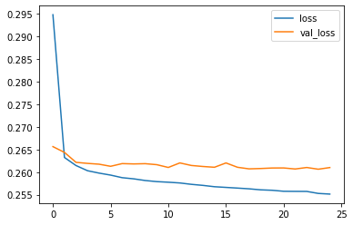
    

**TASK: Create predictions from the X_test set and display a classification report and confusion matrix for the X_test set.**

    2471/2471 [==============================] - 2s 882us/step
    

    array([[1.0000000e+00],
           [1.0000000e+00],
           [1.0000000e+00],
           ...,
           [8.2572055e-01],
           [9.9999982e-01],
           [4.0213730e-17]], dtype=float32)

    array([[15658,     0],
           [38266, 25120]], dtype=int64)

                  precision    recall  f1-score   support
    
               0       0.29      1.00      0.45     15658
               1       1.00      0.40      0.57     63386
    
        accuracy                           0.52     79044
       macro avg       0.65      0.70      0.51     79044
    weighted avg       0.86      0.52      0.54     79044
    
    

**TASK: Given the customer below, would you offer this person a loan?**

    loan_amnt      25000.00
    term              60.00
    int_rate          18.24
    installment      638.11
    annual_inc     61665.00
                     ...   
    30723              1.00
    48052              0.00
    70466              0.00
    86630              0.00
    93700              0.00
    Name: 305323, Length: 77, dtype: float64

    1/1 [==============================] - 0s 17ms/step
    

    array([[1.]], dtype=float32)

**TASK: Now check, did this person actually end up paying back their loan?**

    1.0

# GREAT JOB!
